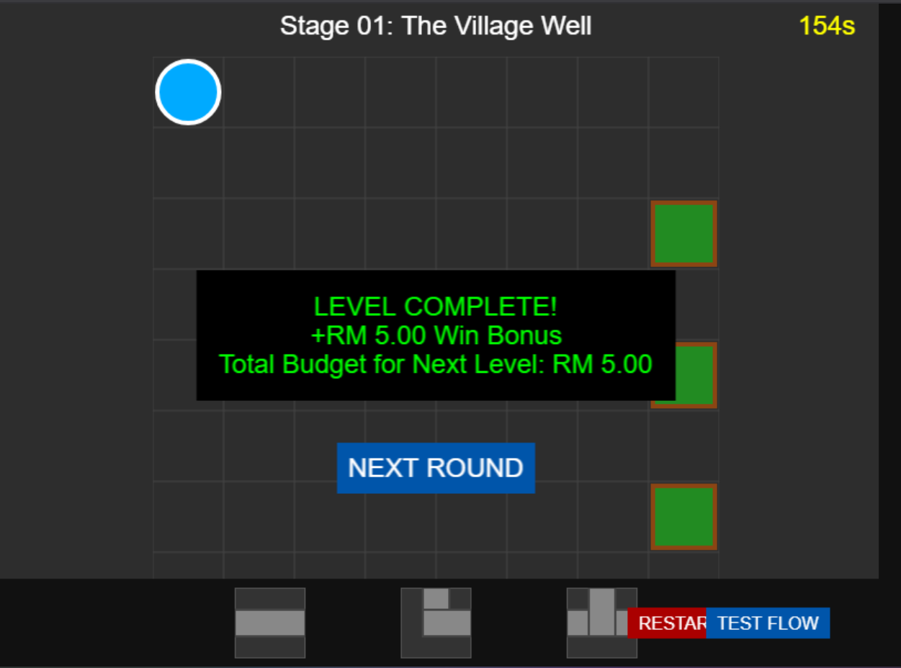
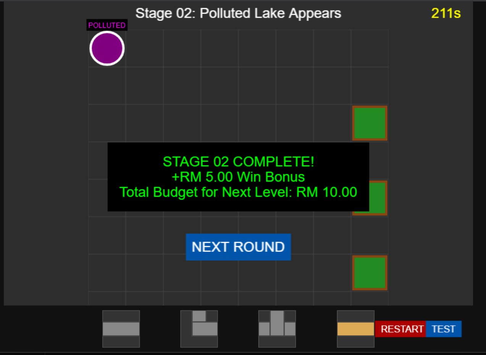
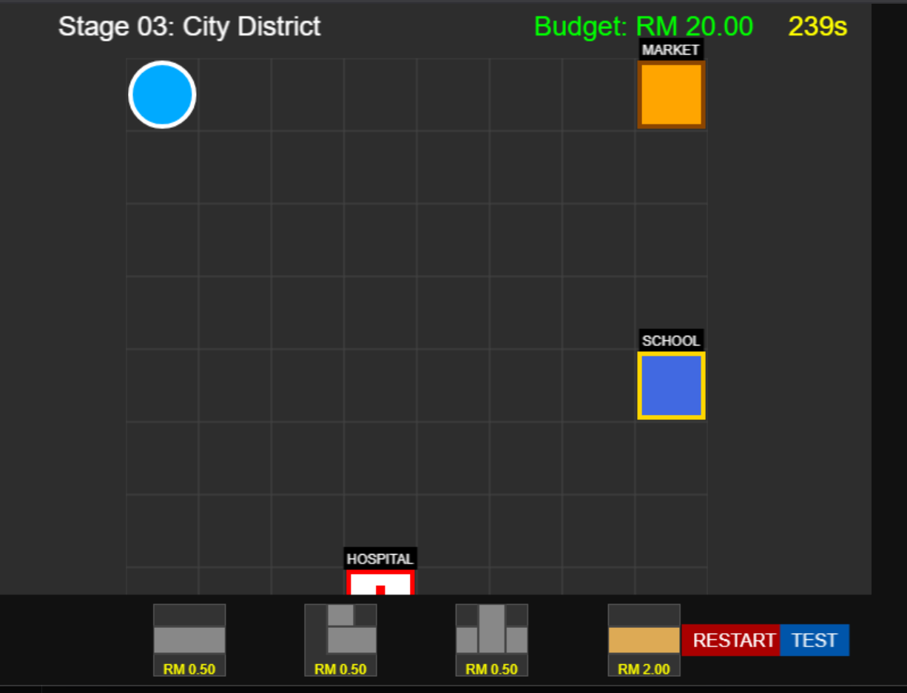
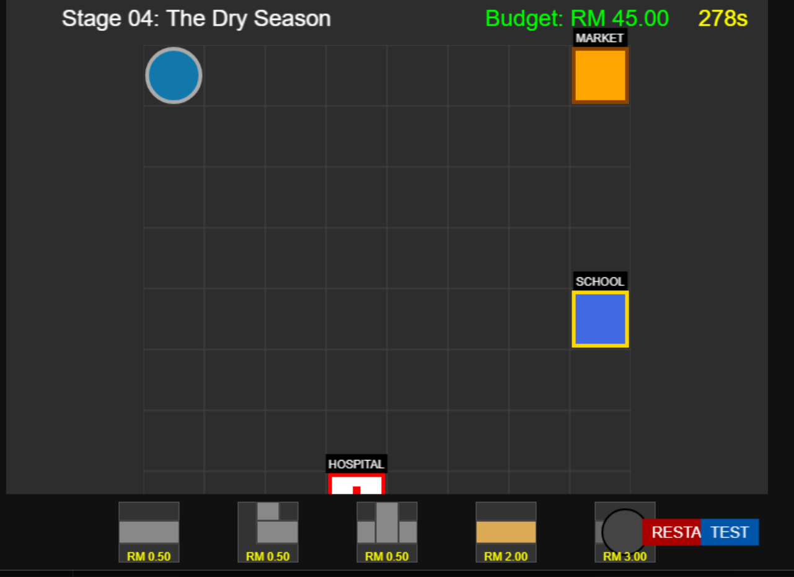
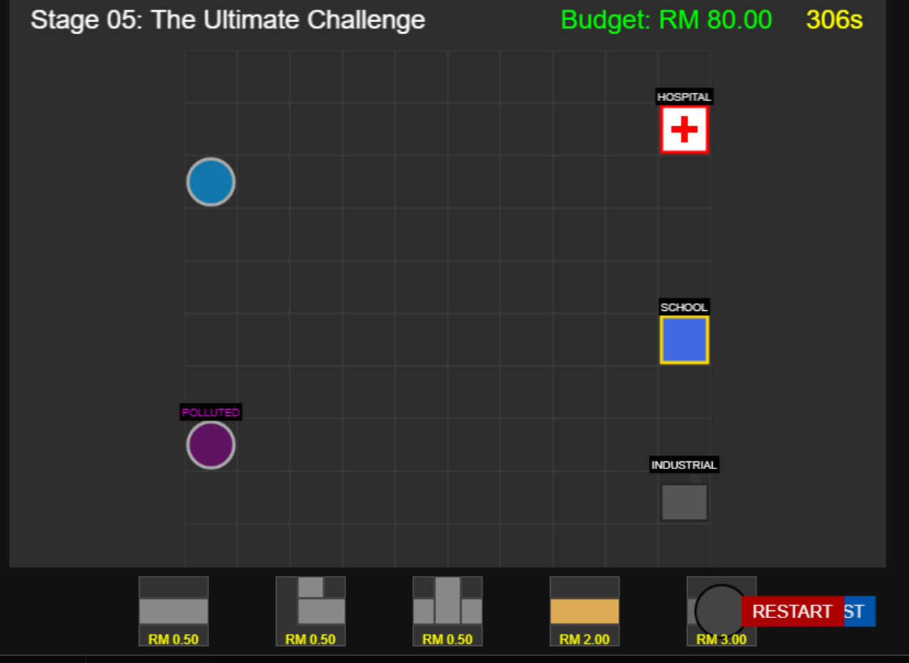

# AquaCity Engineer

A browser-based 2D water management game built with **Phaser** and **Firebase**. Players navigate through multiple stages to solve water distribution challenges, managing pipes and resources to keep the city's water system flowing smoothly.

Live demo: https://aquacity-5b4a9.web.app/

## 🎮 Game Features

- **Interactive Gameplay**: Manage water pipes and resources across 5 challenging stages
- **Progressive Difficulty**: Start with simple tasks and advance to complex water management scenarios
- **Anonymous Authentication**: Firebase-powered login system for seamless gameplay
- **Real-time Updates**: Dynamic game state synchronized across sessions
- **Responsive Design**: Play on desktop browsers with smooth performance

## 🎨 Game Screenshots

### Stage 1


### Stage 2


### Stage 3


### Stage 4


### Stage 5


## 🛠 Tech Stack

- **Phaser 3**: Powerful 2D game framework for web
- **Firebase**: Backend services for authentication and data storage
- **Vite**: Fast build tool and development server
- **JavaScript (ES6+)**: Modern JavaScript for game logic

## 📋 Project Structure

```
AquaCity/
├── src/
│   ├── main.js          # Firebase initialization & entry point
│   ├── game.js          # Game configuration
│   ├── objects/         # Game objects (Pipe, etc.)
│   └── scenes/          # Game stages (Stage01-05)
├── dist/                # Built game files (generated)
├── index.html           # Main HTML file
├── package.json         # Dependencies
└── firebase.json        # Firebase configuration
```

Additional descriptive files for Stage 1 through Stage 5 with screenshots are included in the project documentation.

## 🚀 Getting Started

### Prerequisites
- Node.js (v14 or higher)
- npm or yarn
- A Firebase project account

### Installation

1. Clone the repository:
```bash
git clone https://github.com/YOUR_USERNAME/AquaCity.git
cd AquaCity
```

2. Install dependencies:
```bash
npm install
```

3. Create a `.env.local` file with your Firebase credentials:
```
VITE_FIREBASE_API_KEY=your_api_key
VITE_FIREBASE_AUTH_DOMAIN=your_auth_domain
VITE_FIREBASE_PROJECT_ID=your_project_id
VITE_FIREBASE_STORAGE_BUCKET=your_storage_bucket
VITE_FIREBASE_MESSAGING_SENDER_ID=your_sender_id
VITE_FIREBASE_APP_ID=your_app_id
VITE_FIREBASE_MEASUREMENT_ID=your_measurement_id
```

4. Start development server:
```bash
npm run dev
```

The game will open at `http://localhost:5173`

## 🎯 Building & Deployment

Build for production:
```bash
npm run build
```

Deploy to Firebase Hosting:
```bash
firebase deploy
```

## 📝 Security

- Firebase credentials are stored in `.env.local` (not committed to Git)
- `.gitignore` protects sensitive files from being uploaded
- Security rules are configured in Firebase Console

## 📄 License

ISC

## 🤝 Contributing

Feel free to fork and submit pull requests for improvements!

---

**Play AquaCity and master the city's water management challenges!** 💧
